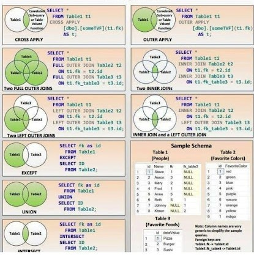
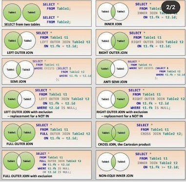

# SQL Basic Level
## 1. Info
>This ***Readme*** file aims to provide summary information about ***queries***.
### I add relevant links under each assignment.

## 2. Links
#### 1. Links Markdown
>In order to obtain better outputs in such ***information files***,
>>If you want to get ***detailed*** information about ***markdown*** : [markdown](https://www.markdownguide.org/cheat-sheet/) 
#### 2. Links to SQL tutorial

> [w3schools](https://www.w3schools.com/sql/)

> [Patika](https://app.patika.dev/courses/sql)

> [CodeAcademy](https://www.codecademy.com/learn/learn-sql)) 

> [geeksforgeeks](https://www.geeksforgeeks.org/sql-tutorial/?ref=gcse)

### SQL Cheatsheet images and links :

Contains summary information about SQL. 

  
  

 
  If you want to see clearer schematics :
  <a href="https://learnsql.com/blog/sql-basics-cheat-sheet/" target="_blank">SQL Cheatsheet</a>

## 3. DML, DDL, DCL, DQL (?)
  1. DML ?
     1. INSERT  *
     2. DELETE  *
     3. UPDATE  *
     4. MERGE
     5. CALL
     6. EXPLAIN PLAN  
     7. LOCK TABLE 
  3. DDL ?
     1. CREATE *
     2. ALTER *
     3. DROP *
     4. RENAME *
     5. TURUNCATE *
     6. COMMENT
  5. DCL ?
     1. GRANT
     2. REVOKE
     3. INVOKE
   
  7. DQL ?
     1. SELECT
    
----
      
### About Contains
1. info
2. Links
   1. Links Markdown
   2. Links to SQL tutorial  
4. DML, DDL, DCL, DQL ? 
    1. ***https://www.datasciencearth.com/sql-nedir-dml-ddl-dcl-dql-komutlari/***
6. I'll add Fourth item 

